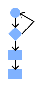

# 17.09.24

**Exercice données :**
Température  Nombre (float)
Nom  Chaine de char
Année de naissance Nombre (int)
Statut d’inscription Bool
Date bachelor Date
Numero postal Nombre (int)
Adresse Objet
Client Objet
Mois Nombre (int)
Liste des modules Liste objet

**Constante :** valeur qui ne change pas lors de l’exécution de l’algorithme
**Variable :** valeur qui va varier pendant l’exécution de l’algorithme

**Convention :**

- Espace autour des opérations
- Espace après les deux points du type
- Mettre le type au variable
- Variable minuscule avec _ entre les mots

---

# **22.09.24**

**Serie 1**

**Exercice 1 :**

Indiquer les énoncés qui peuvent être considérés comme des propositions de la logique

des propositions.

1. Janvier a 31 jours.

**
    Non**

2. De combien de lettres est constitué l’alphabet ?

**
    Non**

3. La proposition que vous êtes en train de lire est fausse.

**
    Oui**

4. Mettez vos chaussures !

**
    Non**

5. Jean et Charles sont frères et Alice et Emma sont cousines.

**
    Oui**

6. 4 est le carré de ±2.

**
    Non**

**Exercice 2 :**

Soient les propositions suivantes :

**A = “je suis fatigué”**

**B = “je suis heureux”**

Traduire en langage usuel les propositions suivantes :

(! est le signe de négation j’ai pas le symbole du cours)

1. !A

   ON EST PAS FATIGUE !!!! (Je suis pas fatigué)
2. !(!A)

   Je suis fatigué (Je suis fatiguant surtout)
3. !A **ou** B

   Je ne suis pas fatigué ou je suis heureux
4. !(!A **ou** B)

   Je suis fatigué et je ne suis pas heureux
5. !(A **et** B)

   Je suis pas fatigué ou je suis pas heureux
6. !A **ou** !B

   Je suis pas fatigué ou je suis pas heureux
7. !(A **ou** B)

   Je suis ni fatigué ni heureux
8. !A  **et** !B

   Je suis pas fatigué et pas heureux

# 24.09.24



**Conditions :**

`````
if prix > 100:
	print(« Prix plus grand que 100 »)
else:
	print(« Prix plus petit que 100 »)
---

if prix > 100:
	print(« Prix plus grand que 100 »)
elif prix > 30
	print(« Prix plus grand que 30 »)
else
	print(« Prix plus petit que 100 »)
`````

**Opérateurs :**

**<**	plus petit que

**>** plus grand que

**>=**	plus grand ou égal

**<=**	plus petit ou égal

**==**	égal

**!=**	pas égal

**and**	permet de faire un ET logique

**not**	permet de faire une inversion logique -> vrai deviens faux etc

**Méthodes, Fonctions :**

x.isnumeric() : retourne vrai si c’est un nombre ou faux si ce n’en ai pas, x qui doit etre une variable/constante

---

# **01.10.24**

**Pseudo-Code :** permet de décrire un problème/programme avec un langage presque naturel

**Organigramme :** comme pseudo-code mais avec des diagrammes

**Decomposition :** séparer la logique du programme en petite partie défini de sorte à y aller étape par étape
