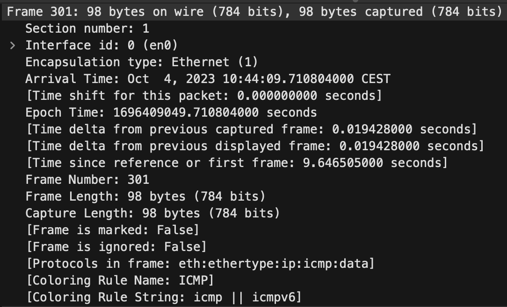

# Labo 0 Costantino Volta
# Table of Contents
1. [A](#A)
    1. [A1](#1)
    2. [A2](#2)
    3. [A3](#3)
    4. [A4](#4)
    5. [A5](#5)
2. [B](#B)
    1. [B1](#1-1)
    2. [B2](#2-1)
    3. [B3](#3-1)
    4. [B4](#4-1)
    5. [B5](#5-1)
3. [C](#C)
    1. [C1](#1-2)
    2. [C2](#2-2)
    3. [C3](#3-2)
## A
### 1.
OK
### 2. 
10.136.204.209
### 3.
OK
### 4. 
OK
### 5.
OK
## B
### 1. 
Source : 10.136.204.209
Destination : 172.217.168.78
### 2. 
Source : 172.217.168.78
Destination : 10.136.204.209
On voit que ce sont les mêmes adresses dans un sens et dans l'autre
### 3. 
La destination du request est la même, la destination du reply non car nous ne sommes pas sur le même ordinateur
### 4.
Request :
    Source : 1c:91:80:c5:e4:ce
    Destination :  00:1c:7f:a2:ce:08     

Reply :
    Source : 00:1c:7f:a2:ce:08 
    Destination : 1c:91:80:c5:e4:ce
### 5.
Encore une fois ce sont les mêmes adresses
## C
### 1.

On se trouve sur la couche 3.
Le message ICMP est encapsulé sur 98 bytes, on a d'abord une partie concernant les adresses ethernet de source et de destination, puis une partie concernant les adresse IPv4 et pour finir la partie ICMP.
Le type d'encapsulation est Ethernet.
### 2.
bbb.hesge.ch ne répondait pas au ping.
### 3.
L'adresse IP de source (request) et de destination (reply) n'a pas changé étant la mienne. L'adresse de destination (request) et de source (reply) ont changés étant celles d'infomaniak.
Quand a l'adresse Ethernet elle n'a pas changé car il s'agit de l'adresse du firewall et non de la destination, tant que je serais connecté sur le même réseau l'adresse Ethernet ne devrait pas changer.
L'adresse a changé car chaque destinataire et chaque source a sa propre adresse il est donc normal que l'adresse encapsulée change lorsque l'on change la destination du ping.
