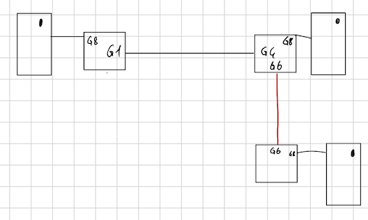

# Labo 2 Costantino Volta, Radhwan Hassine
## A Configuration de base du switch
1. La table du switch GS308T peut contenir jusqu'à 8000 adresses MAC.
2. Le switch peut commuter des trames à 16 000 Mb/s.
3. La taille du buffer utilisé pour la commutation est de 512 KB/s.
4. Trame minimum = 512 bits et trame maximum = 12144 bits.
(512 000 * 8 = 4 096 000) / 512 = 8000, on peut donc mettre 8000 trames de taille minimale dans le buffer.
4 096 000 / 12 144 = 337 trames de taille maximale dans le buffer.
5. 
    1. Ordi 17 : 192.168.0.17
    2. Ordi 3 : 192.168.0.3
6. ping OK
7. ```bash ssh -o UserKnownHostsFile=/dev/null -o StrictHostKeychecking=no admin@192.168.0.239```
8. Password = Labolabo22
9. ```bash 
    configure
    system name S-10 / S-02
    ```
10. ```bash 
    ordi : ssh -o UserKnownHostsFile=/dev/null -o StrictHostKeychecking=no admin@192.168.0.239
    sw : mets le mot de passe
    sw : config
    sw(config): ip address 192.168.10/02
    DECONNEXION, relance terminal
    ordi : ssh -o UserKnownHostsFile=/dev/null -o StrictHostKeychecking=no admin@192.168.0.10/07
    ```
11. Pour désactiver STP ! Obligé d'utiliser interface web
## B Mise en place du réseau et création d'une boucle
1. Ok
2. Les ordinateurs arrivent a se ping
3. Ok
4. ```bash ping -b 192.168.0.255```
5. Les leds des port rj-45 sur lesquels des cables sont branchés, clignotent vite. Cela represente le fait qu'il a une boucle et donc un paquet qui circule a l'infini entre g1-g4 g5-g2, ssh marche pas car canal saturé par le ping qui tourne en boucle
6. Les leds clignote normalement, la boucle est rompu
7. Tout remarche
8. Non, ce qui provoque l'envoi continu de paquets sur tout les ports au même temps.
## C Détermination de l'arbre couvrant STP
1. Ok
2. ```bash sw : show mac adress-table```
3. g4 pointe sur racine, g1, g2, g8-1, g8-2 sont désignés, et g5 est bloqué
4. 
## D Extension de réseau LLDP
1. Ok
2. Ok
3. 
## E Boucle étendue
1. Ok
2. 
3. Les leds de tout les switchs clignotent
4. On débranche une entre chaque voisin direct, et une des deux qui nous lies aux voisins indirect
5. TTL(Time To Live) = Temps en secondes de la validité de l'informations
## F Nouvelles Topologie
1. La racine est la même qu'avant car il a toujours l'adresse ip la plus petite
2. La racine est la même qu'avant car il a toujours l'adresse ip la plus petite 
3. 
4. Oui, car les switchs ont des priorités établi par STP, si il y a la même c'est l'adresse MAC qui va permettre de modifier la priorité
5. Oui on voit bien le port ayant la priorité la plus basse va faire que le switch ayant ce port va devenir racine
6. On a forcé S-10 a être racine
7. 
8. 
9. 2s, le temps que le message Hello se répande et que l'éléction ait lieu
10. En lui mettant la priorité la plus élevée
## G Reflexions
1. Ok
2. Ok