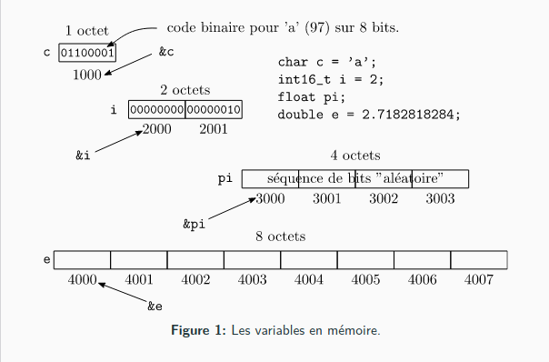

# Algorithmie
## Compilation de code
```
gcc -std=c11 -Wall -Wextra prog.c -o prog
```
## ```main()```
1. Première fonction a être exécuté
2. Return : 0 ou 1; 0 étant tout va bien
3. La valeur de retour peut être lue par le shell qui a exécuté le programme
4. ```EXIT_SUCESS ```et ```EXIT_FAILURE``` (```stdlib.h```) sont des valeurs de retour portables
### Exemple
```c
int main(){
    ... //do something
    if (error){
        return EXIT_FAILURE;
    } else {
        return EXIT_SUCCESS;
    }
}
```
Lire le code d'erreur dans le ```shell```
```shell
$ ./prog
$ echo $?
0 #tout c'est bien passé
$ if [ $? -eq 0 ]; then echo "OK"; else echo "ERROR"; fi
ERROR #si tout c'est mal passé
```
## Génération d'un exécutable
Un seul fichier source
      cpp       gcc        as        ld
prog.c -> prog.i -> prog.s -> prog.o -> prog
                                libc ->
1. Précprocesseur
2. Compilation assembleur
3. Compilation code objet
4. Édition des liens
```shell
gcc prog.c -o prog
```
1. **Précompilation** : ```gcc``` appelle ```cpp```, le prépocesseur qui effectue de la substitution de text (```#define```, ```#include```, macros, ...) et génère le code C à compiler, portant l'extension ```.i``` (```prog.i```)
2. **Compilation assembleur** : ```gcc``` compile le code C en code assembleur, portant l'extension ```.s``` (```prog.s```)
3. **Compilation code objet** ; ```gcc``` appelle ```as```, l'assembleur, qui compile le code assembleur en code machine (code objet) portant l'extension ```.o``` (```prog.o```)
4. **Édition des liens** : ```gcc``` appelle ```ld```, l'éditeur de liens, qui lie le code objet avec les librairies et d'autres codes objet pour produire l'exécutable final (```prog```)
Les différents codes intermediaires sont effacés automatiquement  
## Input Output ```scanf(), printf()```
### Output 
```c
int printf(const char *format, ...);
```
- On peut mettre différents arguments
- Format = Text a afficher et type de variables
- Les arguments suivants (...) sont les expressions à afficher 
#### Exemple
```c
#include <stdio.h> //Input Output
#include <stdlib.h> // Must have lib
int main(){
    printf("Hello World. \n");
    int x = 1;
    // %d => int
    printf("X equal %d. \n", x);
    // %f => float
    float y = 1
    printf("Y/2 equal %f. \n", y/2); // 1/2 == 0.5
    // %s => string
    printf("Hello %s. \n", "World");
    return EXIT_SUCCESS;
}
```
### Input
```c
 int scanf(const char *format, ...);
```
- Format et le format des variables a lire
- Les arguments suivants (...) sont les variables ou les valeurs lues seront stockée. (adresse de variable: ```&x```);
#### Exemple
```c
#include <stdio.h>
#include <stdlib.h>
int main(){
    printf("Enter 3 numbers: \n");
    int i, j, k;
    scanf("%d %d %d", &i, &j, &k); // & = Adresse de la variable
    printf("You entered: %d %d %d", i, j, k);
    return EXIT_SUCCESS;
}
```
## Boucle for(), while()
```c
for (int i = 0; i < x; i++){
    ... //do something
}

int y = 0;
while (y < x){
    ... //do something
    y++;
}
```
### Contrôle : ```continue, break```
```c
int y = 0;
while (y < x){
    // Quand y vaut 2 on va sauter le tour
    if (y == 2){
        continue;
    }

    // Quand y vaut 3 on va sortir de la boucle
    if (y == 3) {
        break;
    }
    ... //do something
    y++;
}
```
## Condition ```if()...else()```
```c
if (/*expression*/ y == x) {
    //instructions (do something);
} else if (/*expression*/ y < x){
    //instructions;
} else {
    //instructions;
}
```
## Nombre aléatoire ```rand(), srand()```
```rand()``` retourne un pseudo-random ```int``` entre 0 et RAND_MAX inclu [0, RAND_MAX]
### Exemple
```c
#include <stdio.h>
#include <stdlib.h>
#include <time.h>
int main(){
    srand(0); // Chaque itération sera identique
    srand(time(NULL)) // Chaque itération sera différente
    for (int i = 0; i < 50; i++){
        printf("%d\n", rand() % 50); // % 50 sert a définir la valeur max, RAND_MAX
    }
    return EXIT_SUCCESS;
}
```
## [TP Nombre Secret](../Pratique/NombreSecretUSRvsPC/main.c) [TP Nombre Secret++](../Pratique/NombreSecretPCvsUSR/main.c)
## Variables
Une variable est l'**identifiant** d'un **espace de stockage** qui contient une **valeur** \
En général une variable possède un **type** (```int, double, ...```) et une **adresse mémoire** (```&var```)
### Pile vs Tas
Pile : ordonnée, taille connue (à la compilation) \
Tas : amas informe, taille dynamique (à la compilation)
### Représenation des variables en mémoire
- Type (```char, int, double, ...```)
- Contenu (une séquence de bits qui encode value)
- Adresse mémoire (accessible via ```&value```)
- Portée (accéssibilité de la variable selon où elle a été définie)


## Les fonctions
- Parties indépendantes d'un programme
- Permette de modulariser et compartimenter le code
### Exemple de syntaxe
```c
type identificateur(paramètres){
// variables optionnelles
instructions;
// type expression == type
return expression; 
}
int NombreSecret(int nombre_secret, int *MAX, int *MIN){
    int guess;
    printf("Veuillez choisir un nombre entre %d et %d : ", *MIN, *MAX-1);
    scanf("%d", &guess);
    if (guess == nombre_secret)
    {
        return 0;
    } else if (guess < nombre_secret)
    {
        printf("Le nombre à trouver est plus grand que %d \n", guess);
        *MIN = guess + 1;
    } else
    {
        printf("Le nombre à trouver est plus petit que %d \n", guess);
        *MAX = guess;
    }
    return guess;
}
```
- Il existe un type ```void```, "sans type", en C
- Il peut signifier que la fonction ne retourne rien, ou qu'elle n'a pas d'arguments
- ```return``` utilisé pour sortir de la fonction
### Exemple
```c
void show_text(void){ // deuxième void optionnel
    printf("Aucun argument est pas de retour. \n");
    return; // optionnel
}
void show_text_again() { // pareil
    printf("Aucun argument et pas de retour \n");
}
```
### Prototypes de fonctions
- Le prototype donne la **signature** de la fonction, avant qu'on connaisse son implémentation
- L'appel de la fonction doit être fait **après** la déclaration du prototype
  ```c
    int max(int a, int b); // prototype

    int max(int a, int b) { // implémentation
        if (a > b){
            return a;
        } else {
            return b;
        }
    }
  ```

  ```c
  // Prototype, pas d'implémentation, juste la doc, signature de la fonction
  int sum(int size, int tab[size]);
  ```
  #### Principes génléraux de programmation
  - Beaucoup de fonctionnalités dans un code -> Modularisation
  - Modularisation du code -> Écriture de fonctions
  - Beaucoup de fonctions -> Regrouper les fonctions dans des fichiers séparés
  ##### Pourquoi ?
  - Lisibilité
  - Raisonnement sur le code
  - Débogage
  ##### Exemple
  Librairie ```stdio.h```: printf(), scanf(), ...
  
  Prototypes de fonctions nécessaires quand :
  1. Utilisation de fonctions dans des fichiers séparés
  2. Utilisation de librairies
  Un prototype indique au compilateur la signature d'une fonction
  On met les prototypes des fonctions **publiques** dans des fichiers headers, extension ```.h```
  Les implémentations de fonctions vont dans des fichiers ```.c```
  #### Fichier header
  - Porte l'extension ```.h```
  - Contient :
    - Définitions des types
    - Prototypes de fonctions
    - Macros
    - Directives préprocesseur
  - Utilisé pour décrire **l'interface** d'une librairie ou d'un module
  - Un fichier C (extension ```.c```) utilise un header en l'important avec la directive ```#include```:
    ```c
    #include <stdio.h> // Dans LD_LIBRARY_PATH
    #include "chemin/du/prototypes.h" // Explicite
    ```
### Arguments de fonctions
- Les arguments d'une fonction sont toujours passés par **copie** (!!!)
- Les arguments d'une fonction ne peuvent **jamais** être modifié
  ```c
    void set_to_two(int a){ // a : nouvelle variable
        // la valeur de a est une copie de x, lors de l'appel elle vaut -1
        a = 2 // la valeur de a est fixée a 2
    } // a est détruite
    int main() {
        int x = -1;
        set_to_two(x); // -1 passé en argument
        printf("%d", x); // x = -1
    }
  ```
#### Pointeurs
- Pour modifier une variable, il faut passer son adresse mémoire
- L'adresse d'une variable ```x```, est accédé par ```&x```
- Un pointeur vers une variable entière a le type, ```int *x```
- La syntaxe ```*x``` sert à **déréférencer** le pointeur (accéder à la mémoire pointée)
##### Exemple
```c
void set_to_two(int *a){
    // a contient une copie de l'adresse de la variable passée en argument
    *a = 2; // on accède à la valeur pointée par a, et on lui assigne 2
} // le pointeur est détruit, pas la valeur pointée
int main(){
    int x = -1;
    set_to_two(&x); // on passe l'adresse de x
    // x = 2
}
```
## Tableaux
### Tableaux statiques
Une **liste** ou un **ensemble** d'éléments du **même type** alloués de façon **contigüe** (en bloc) en mémoire, 
sur la pile dont la taille **ne peut pas** être changée

- Les éléments d'un tableau son accédés avec [```i```] ou ```i``` est l'index de l'élément
- Le premier élément du tableau à l'index 0 !
- Lorsqu'un tableau est déclaré, la taille de celui-ci doit toujours être spécifiée, sauf s'il est initialisé lors de sa déclaration
- Un tableau local à une fonction ne doit **jamais être retourné !**
#### Syntaxe
```c
float tab1[5]; // tableau de floats é 5 éléments, ses valeurs sont indéfinies
int tab2[] = {1, 2, 3}; // tableau de 3 entiers, taille inférée
int val = tab2[1]; // val = 2
int w = tab1[5]; // index hors des limites du tableau, comportement indéfini !, pas d'erreur de compilateur
```
#### Itération
```c
int x[10];
for (int i = 0; i < 10; i++) {
    x[i] = 0
}
int j = 0;
while (j < 10){
    x[j] = 1;
    j++;
}
int k = 0;
do {
    x[k] = -1;
    k++;
} while (k < 10)
```
#### Représentation des tableaux en mémoire
La mémoire est **contingüe** et **accessible très rapidement**
##### Exemple
```c
char tab[4] = {79, 91, 100, 88} // char|addr 79|2000 91|2001 100|2002 88|2003

tab; // 2000, l'addresse du 1er élément
&tab[0] // 2000 == tab
tab[0] // 79
sizeof(tab): // 4
```
#### Tableaux comme arguments de fonctions
- Un tableau en argument est le pointeur vers sa première case
- Pas moyen de connaître sa taille : ```sizeof()``inutile
- Toujours spécifier la taille d'un tableau passé en argument
  ```c
    void foo(int tab[]) // équivalent à int *tab
    // que vaut sizeof(tab)
    for (int i = 0; i < ?; i++){
        printf("tab[%d] = %d \n", i, tab[i]);
    }
    void bar(int n, int tab[n]){ // [n] optionnel
        for (int i = 0; i < n; i++){
            printf("tab[%d] = %d \n", i, tab[i]);
        }
    }
  ```
## Structures ```struct```
### Fractions
- Numérateur : ```int num```;
- Dénominateur : ```int denom```;
#### Addition
```c
int num1 = 1, denom1 = 2;
int num2 = 1, denom2 = 3;
int num3 = num1 * denom2 + num2 * denom1;
int denom3 = denom1 * denom2;
// Pas très pratique
```
### On peut faire mieux
Plusieurs variables qu'on aimerait regrouper dans un seul type : ```struct```
```c
struct fraction { // déclaration d'un type
  int32_t num, denom;
};
struct fraction frac; // déclaration de frac
```
### Simplifications
```typedef``` permet de définir un nouveau type
```c
typedef unsigned int uint;
typedef struct fraction fraction_t
typedef struct fraction {
  int32_t num, denom;
} fraction_t;
// L'initialisation peut aussi se faire avec
fraction_t frac = {1, -2}; // num = 1, denom = -2
fraction_t frac = {.denom = 1, .num = -2};
fraction_t frac = {.denom = 1}; // argl! .num non initialisé
fraction_t frac2 = frac; // copie
```
### Pointeurs
- Comme pour tout type, on peut avoir des pointeurs vers un struct
- Les champs sont accessible avec le sélecteur :
  ```c
  fraction_t *frac; // on crée un pointeur
  frac->num = 1; //seg fault...
  frac->denom = -1; // mémoire pas allouée
  ```
#### Initialisation
- Avec le passage par ***référence*** on peut modifier un sruct en place
- Les champs sont accessible avec le sélecteur ->
  ```c
  // Version pointeur
  void fraction_init(fraction_t *f, int32_t num, int32_t denom){
    // f a déjà été allouée
    f->num = num;
    f->denom = denom;
  }
  int main(){
    fraction_t frac; // on alloue une fraction
    fraction_init(&frac, 2, -1); // on l'initialise
  }

  // Version copie
  fraction_t fraction_create(int32_t num, int32_T denom){
    fraction_t f;
    f.num = num; f.denom = denom;
    return f;
  }
  int main(){
    // on crée une fraction et on l'initialise en copiant la fraction retournée par fraction_create
    fraction_t frac = fraction_create(2, -1);
  }
  ```
## String
- Pas de type ```string``` en c, une ```string``` est enfaite un tableau de ```char``` qui se termine avec le charactère ```\0```
  ```c
  char *str = "HELLO !"; // statique
  ```
  Représenté par : H E L L O _ ! \0   Le _ étant un espace
### Syntaxes alternatives
```c
char name[10]; // Code ASCII
name[0] = 'P'; // 70
name[1] = 'a'; // 97
name[2] = 'u'; // 117
name[3] = 'l'; // 108
name[4] = '\0'; // 0
char name[] = {'p', 'a', 'u', 'l', '\0'};
```
- Il existe une grande quantité de fonction pour manipuler les 'string' dams string.h
- Fonctions principales :
  ```c
  size_t strlen(char *str);
  char *strcpy(char *dest, const char *src);
  char *strncpy(char *dest, const char *src, size_t len);
  int strncmp(char *str1, char *str2, size_t len);
  int strcmp(char *str1, char *str2);
  ```
## Génération d'un 